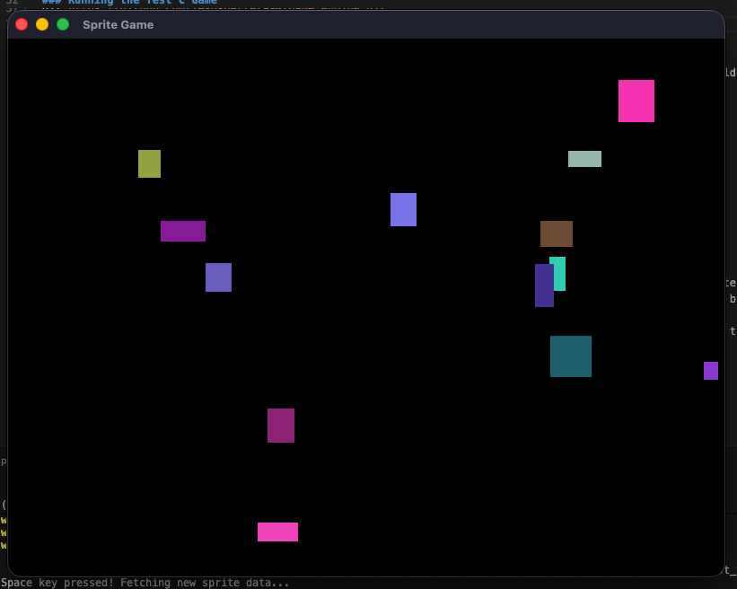

# Game Engine with C and Rust
This project is for the Udacity's Introduction to Rust course.

### Local environment prerequisites

While this project has no specific dependencies on any system, it was built on a Unix-based machine. So, if you're on Windows, I'd recommend using the Windows Subsystem for Linux (WSL), so all instructions here directly apply to your system.  

For this project, you'll need to have Rust installed in your machine. If you haven't installed Rust yet, you can do so with:

```bash
curl --proto '=https' --tlsv1.2 -sSf https://sh.rustup.rs | sh
```

Also, because we are dealing with C code in this project, you'll need to have a C compiler installed on your machine. You can install the `build-essential` package, which includes the GNU C Compiler (GCC) and other necessary tools:

```bash
sudo apt update
sudo apt install build-essential
```

Finally, you'll need to have GLFW installed in your machine. GLFW is a C library that will be the foundation of our game engine. You can install it with:

#### Linux
```bash
sudo apt install libglfw3 libglfw3-dev
```

#### Mac
```bash
sudo brew install glfw 
```

### Running the Test C Game

To start with your project, clone this repository to your local machine:

```bash
git https://github.com/jesusherrera94/game_engine.git
# or, git clone git@github.com:jesusherrera94/game_engine.git
```

To ensure you are set up correctly, you can run the test C game that comes with this project. You can build and run the test game with:

```bash
cd intro-to-rust-starter/starter
make run-c
```

You should see the following pop-up window:


### Starting the Rust Game Engine

At this point you may be able to run this project, to test the engine running in a binary crate run the following commands:
```bash
cd starter/rust_test_game
cargo run
```

You should see something similar everytime you press the ```space``` key on your keyboard.



## License

[License](LICENSE.txt)
